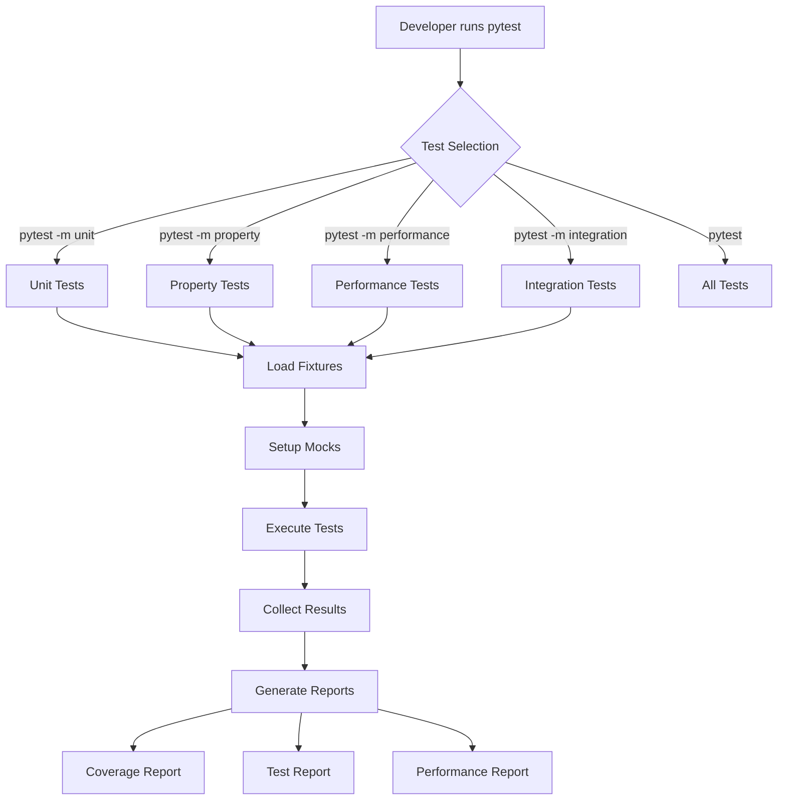

# Design Document: Unit and Performance Testing Framework

## Overview

This design document specifies a comprehensive testing framework for the finmatcher application. The framework encompasses unit testing, property-based testing, performance benchmarking, memory profiling, and end-to-end flow testing. The design leverages pytest as the core test runner with specialized plugins for coverage analysis, benchmarking, mocking, and parallel execution.

The testing framework addresses three primary concerns:

1. **Correctness Verification**: Unit tests and property-based tests ensure that individual components and complete workflows function correctly across diverse inputs and edge cases
2. **Performance Validation**: Benchmark tests and memory profiling detect performance regressions and resource usage issues
3. **Integration Assurance**: End-to-end flow tests verify that components work together correctly in realistic scenarios

The framework is designed to run efficiently in both local development environments and CI/CD pipelines, with clear separation between fast unit tests and slower integration/performance tests.

## Architecture

### Test Framework Layers

The testing architecture consists of four distinct layers:

```
┌─────────────────────────────────────────────────────────────┐
│                    Test Execution Layer                      │
│  (pytest + plugins: xdist, timeout, html, cov, benchmark)   │
└─────────────────────────────────────────────────────────────┘
                              │
┌─────────────────────────────────────────────────────────────┐
│                    Test Organization Layer                   │
│         (Unit Tests │ Property Tests │ Performance          │
│          Tests │ Flow Tests)                                 │
└─────────────────────────────────────────────────────────────┘
                              │
┌─────────────────────────────────────────────────────────────┐
│                   Test Support Layer                         │
│    (Fixtures │ Mocks │ Generators │ Test Data)              │
└─────────────────────────────────────────────────────────────┘
                              │
┌─────────────────────────────────────────────────────────────┐
│                  Application Under Test                      │
│              (finmatcher modules)                            │
└─────────────────────────────────────────────────────────────┘
```

### Directory Structure

```
tests/
├── unit/                          # Fast isolated unit tests
│   ├── core/                      # Tests for core components
│   │   ├── test_email_fetcher.py
│   │   ├── test_statement_parser.py
│   │   ├── test_ocr_engine.py
│   │   └── test_matcher_engine.py
│   ├── optimization/              # Tests for optimization components
│   │   ├── test_bloom_filter.py
│   │   ├── test_spatial_indexer.py
│   │   └── test_vectorized_scorer.py
│   ├── orchestration/             # Tests for orchestration
│   │   └── test_workflow_manager.py
│   ├── reports/                   # Tests for reporting
│   │   ├── test_excel_generator.py
│   │   └── test_drive_sync.py
│   └── database/                  # Tests for database operations
│       └── test_cache_manager.py
├── property/                      # Property-based tests
│   ├── test_matching_properties.py
│   ├── test_parsing_properties.py
│   └── test_bloom_filter_properties.py
├── performance/                   # Performance benchmarks
│   ├── test_email_processing_benchmark.py
│   ├── test_parsing_benchmark.py
│   ├── test_ocr_benchmark.py
│   ├── test_matching_benchmark.py
│   └── baselines/                 # Performance baseline data
│       └── baseline_metrics.json
├── integration/                   # End-to-end flow tests
│   ├── test_full_reconciliation_flow.py
│   ├── test_incremental_processing_flow.py
│   └── test_error_recovery_flow.py
├── fixtures/                      # Shared test fixtures
│   ├── __init__.py
│   ├── conftest.py               # Pytest fixtures
│   ├── sample_data.py            # Sample test data
│   ├── mock_services.py          # Mock external services
│   └── generators.py             # Test data generators
├── data/                          # Test data files
│   ├── emails/                   # Sample email data
│   ├── statements/               # Sample statement files
│   └── expected_results/         # Expected test outputs
└── conftest.py                   # Root pytest configuration

pytest.ini                         # Pytest configuration
.coveragerc                        # Coverage configuration
```

### Test Execution Flow



## Components and Interfaces

### Test Execution Components

#### PyTest Configuration

The pytest configuration defines test discovery, markers, and execution parameters:

```python
# pytest.ini
[pytest]
minversion = 8.0
testpaths = tests
python_files = test_*.py
python_classes = Test*
python_functions = test_*

markers =
    unit: Fast isolated unit tests
    property: Property-based tests using Hypothesis
    performance: Performance benchmark tests
    integration: End-to-end integration tests
    slow: Tests that take more than 1 second
    requires_db: Tests that require database access
    requires_api: Tests that require external API access

addopts =
    --strict-markers
    --strict-config
    --verbose
    --tb=short
    --cov=finmatcher
    --cov-report=html
    --cov-report=term-missing
    --cov-fail-under=80
    --maxfail=5
    --timeout=300

# Parallel execution
xdist_auto_num_workers = auto

# Coverage configuration
[coverage:run]
source = finmatcher
omit =
    */tests/*
    */test_*.py
    */__pycache__/*
    */venv/*

[coverage:report]
precision = 2
show_missing = true
skip_covered = false
exclude_lines =
    pragma: no cover
    def __repr__
    raise AssertionError
    raise NotImplementedError
    if __name__ == .__main__.:
    if TYPE_CHECKING:
```

#### Test Runner Interface

```python
# tests/runner.py
from typing import List, Optional
from pathlib import Path
import pytest

class TestRunner:
    """
    Wrapper for pytest execution with custom configuration.
    """
    
    def run_unit_tests(self, parallel: bool = True) -> int:
        """
        Run fast unit tests.
        
        Args:
            parallel: Enable parallel execution with pytest-xdist
            
        Returns:
            Exit code (0 for success)
        """
        args = ["-m", "unit", "--tb=short"]
        if parallel:
            args.extend(["-n", "auto"])
        return pytest.main(args)
    
    def run_property_tests(self, iterations: int = 100) -> int:
        """
        Run property-based tests with specified iterations.
        
        Args:
            iterations: Number of test iterations per property
            
        Returns:
            Exit code (0 for success)
        """
        args = [
            "-m", "property",
            f"--hypothesis-iterations={iterations}",
            "--tb=short"
        ]
        return pytest.main(args)
    
    def run_performance_tests(self, compare_baseline: bool = True) -> int:
        """
        Run performance benchmark tests.
        
        Args:
            compare_baseline: Compare against baseline metrics
            
        Returns:
            Exit code (0 for success)
        """
        args = [
            "-m", "performance",
            "--benchmark-only",
            "--benchmark-autosave"
        ]
        if compare_baseline:
            args.append("--benchmark-compare")
        return pytest.main(args)
    
    def run_integration_tests(self) -> int:
        """
        Run end-to-end integration tests.
        
        Returns:
            Exit code (0 for success)
        """
        args = ["-m", "integration", "--tb=long"]
        return pytest.main(args)
    
    def run_all_tests(self, parallel: bool = True) -> int:
        """
        Run complete test suite.
        
        Args:
            parallel: Enable parallel execution for unit tests
            
        Returns:
            Exit code (0 for success)
        """
        args = ["--tb=short"]
        if parallel:
            args.extend(["-n", "auto", "-m", "not slow"])
        return pytest.main(args)
```

### Test Fixture Components

#### Database Fixtures

```python
# tests/fixtures/conftest.py
import pytest
from pathlib import Path
import tempfile
from finmatcher.storage.database_manager import DatabaseManager

@pytest.fixture(scope="function")
def temp_db():
    """
    Provide isolated temporary database for each test.
    Automatically cleans up after test completion.
    """
    with tempfile.NamedTemporaryFile(suffix=".db", delete=False) as f:
        db_path = Path(f.name)
    
    db_manager = DatabaseManager(db_path)
    db_manager.initialize_schema()
    
    yield db_manager
    
    db_manager.close()
    db_path.unlink(missing_ok=True)

@pytest.fixture(scope="session")
def shared_test_db():
    """
    Provide shared test database for session.
    Used for read-only test data.
    """
    db_path = Path("tests/data/test_database.db")
    db_manager = DatabaseManager(db_path)
    db_manager.initialize_schema()
    
    # Load test data
    _load_test_data(db_manager)
    
    yield db_manager
    
    db_manager.close()

def _load_test_data(db_manager: DatabaseManager):
    """Load sample test data into database."""
    # Implementation for loading test fixtures
    pass
```

#### File System Fixtures

```python
# tests/fixtures/conftest.py (continued)
@pytest.fixture(scope="function")
def temp_dir():
    """
    Provide temporary directory that auto-cleans.
    """
    with tempfile.TemporaryDirectory() as tmpdir:
        yield Path(tmpdir)

@pytest.fixture(scope="function")
def sample_email_files(temp_dir):
    """
    Provide sample email files for testing.
    """
    email_dir = temp_dir / "emails"
    email_dir.mkdir()
    
    # Copy sample emails from test data
    sample_dir = Path("tests/data/emails")
    for email_file in sample_dir.glob("*.eml"):
        shutil.copy(email_file, email_dir)
    
    return email_dir

@pytest.fixture(scope="function")
def sample_statement_files(temp_dir):
    """
    Provide sample statement files for testing.
    """
    statement_dir = temp_dir / "statements"
    statement_dir.mkdir()
    
    # Copy sample statements
    sample_dir = Path("tests/data/statements")
    for stmt_file in sample_dir.glob("*"):
        shutil.copy(stmt_file, statement_dir)
    
    return statement_dir
```

#### Mock Service Fixtures

```python
# tests/fixtures/mock_services.py
import pytest
from unittest.mock import Mock, MagicMock, patch
from typing import Dict, List, Any

@pytest.fixture
def mock_gmail_service():
    """
    Mock Gmail API service for testing email fetcher.
    """
    service = MagicMock()
    
    # Mock messages().list() response
    service.users().messages().list().execute.return_value = {
        'messages': [
            {'id': 'msg1', 'threadId': 'thread1'},
            {'id': 'msg2', 'threadId': 'thread2'}
        ],
        'nextPageToken': None
    }
    
    # Mock messages().get() response
    def mock_get_message(userId, id, format):
        return MagicMock(execute=lambda: {
            'id': id,
            'payload': {
                'headers': [
                    {'name': 'Subject', 'value': 'Test Receipt'},
                    {'name': 'From', 'value': 'vendor@example.com'},
                    {'name': 'Date', 'value': 'Mon, 1 Jan 2024 12:00:00 +0000'}
                ],
                'parts': []
            }
        })
    
    service.users().messages().get.side_effect = mock_get_message
    
    return service

@pytest.fixture
def mock_drive_service():
    """
    Mock Google Drive API service for testing drive sync.
    """
    service = MagicMock()
    
    # Mock files().create() response
    service.files().create().execute.return_value = {
        'id': 'file123',
        'name': 'test_report.xlsx',
        'mimeType': 'application/vnd.openxmlformats-officedocument.spreadsheetml.sheet'
    }
    
    # Mock files().list() response
    service.files().list().execute.return_value = {
        'files': [
            {'id': 'folder1', 'name': 'FinMatcher Reports', 'mimeType': 'application/vnd.google-apps.folder'}
        ]
    }
    
    return service

@pytest.fixture
def mock_ocr_engine():
    """
    Mock OCR engine for testing without actual OCR processing.
    """
    with patch('pytesseract.image_to_string') as mock_ocr:
        mock_ocr.return_value = "Sample OCR text\nAmount: $123.45\nDate: 2024-01-01"
        yield mock_ocr
```

#### Test Data Generators

```python
# tests/fixtures/generators.py
from typing import List, Optional
from datetime import datetime, timedelta
import random
from faker import Faker
from finmatcher.storage.models import Transaction, Receipt, Attachment

fake = Faker()

class TransactionGenerator:
    """
    Generate synthetic transaction data for testing.
    """
    
    @staticmethod
    def generate_transaction(
        amount: Optional[float] = None,
        date: Optional[str] = None,
        description: Optional[str] = None
    ) -> Transaction:
        """
        Generate a single transaction with optional parameters.
        """
        return Transaction(
            date=date or fake.date_between(start_date='-1y', end_date='today').isoformat(),
            description=description or fake.company(),
            amount=amount or round(random.uniform(10.0, 1000.0), 2),
            category=random.choice(['Shopping', 'Dining', 'Travel', 'Utilities']),
            source='test_statement'
        )
    
    @staticmethod
    def generate_transactions(count: int) -> List[Transaction]:
        """
        Generate multiple transactions.
        """
        return [TransactionGenerator.generate_transaction() for _ in range(count)]
    
    @staticmethod
    def generate_matching_pair() -> tuple[Transaction, Receipt]:
        """
        Generate a transaction and matching receipt.
        """
        amount = round(random.uniform(10.0, 1000.0), 2)
        date = fake.date_between(start_date='-1y', end_date='today').isoformat()
        vendor = fake.company()
        
        transaction = Transaction(
            date=date,
            description=vendor,
            amount=amount,
            category='Shopping',
            source='test_statement'
        )
        
        receipt = Receipt(
            email_id=fake.uuid4(),
            subject=f"Receipt from {vendor}",
            sender=f"{vendor.lower().replace(' ', '')}@example.com",
            date=date,
            amount=amount,
            vendor=vendor,
            attachments=[]
        )
        
        return transaction, receipt

class ReceiptGenerator:
    """
    Generate synthetic receipt data for testing.
    """
    
    @staticmethod
    def generate_receipt(
        amount: Optional[float] = None,
        date: Optional[str] = None,
        vendor: Optional[str] = None
    ) -> Receipt:
        """
        Generate a single receipt with optional parameters.
        """
        vendor = vendor or fake.company()
        return Receipt(
            email_id=fake.uuid4(),
            subject=f"Receipt from {vendor}",
            sender=f"{vendor.lower().replace(' ', '')}@example.com",
            date=date or fake.date_between(start_date='-1y', end_date='today').isoformat(),
            amount=amount or round(random.uniform(10.0, 1000.0), 2),
            vendor=vendor,
            attachments=[]
        )
    
    @staticmethod
    def generate_receipts(count: int) -> List[Receipt]:
        """
        Generate multiple receipts.
        """
        return [ReceiptGenerator.generate_receipt() for _ in range(count)]
```

### Mocking Strategy

#### External API Mocking

All external API calls (Gmail API, Google Drive API) are mocked using pytest-mock to ensure:
- Tests run without network access
- Tests execute quickly
- Tests are deterministic and repeatable
- No external service dependencies

#### Database Mocking

Two approaches for database testing:
1. **In-memory SQLite**: For fast unit tests that need database functionality
2. **Temporary file database**: For integration tests that need persistence

#### File System Mocking

Use pytest's `tmp_path` fixture and custom `temp_dir` fixtures to:
- Isolate file operations
- Automatic cleanup after tests
- No pollution of actual file system

## Data Models

### Test Result Models

```python
# tests/models/test_results.py
from dataclasses import dataclass
from typing import List, Optional, Dict
from datetime import datetime

@dataclass
class TestResult:
    """
    Represents the result of a single test execution.
    """
    test_name: str
    status: str  # 'passed', 'failed', 'skipped', 'error'
    duration: float  # seconds
    error_message: Optional[str] = None
    stack_trace: Optional[str] = None

@dataclass
class CoverageResult:
    """
    Represents code coverage metrics.
    """
    module_name: str
    total_lines: int
    covered_lines: int
    coverage_percentage: float
    missing_lines: List[int]

@dataclass
class PerformanceResult:
    """
    Represents performance benchmark results.
    """
    benchmark_name: str
    mean_time: float  # seconds
    std_dev: float
    min_time: float
    max_time: float
    iterations: int
    memory_peak: Optional[float] = None  # MB

@dataclass
class TestSuiteReport:
    """
    Aggregated report for entire test suite.
    """
    timestamp: datetime
    total_tests: int
    passed: int
    failed: int
    skipped: int
    duration: float
    coverage_overall: float
    test_results: List[TestResult]
    coverage_results: List[CoverageResult]
    performance_results: List[PerformanceResult]
```

### Performance Baseline Model

```python
# tests/performance/baseline_model.py
from dataclasses import dataclass
from typing import Dict
from datetime import datetime
import json
from pathlib import Path

@dataclass
class PerformanceBaseline:
    """
    Stores baseline performance metrics for regression detection.
    """
    timestamp: datetime
    git_commit: str
    benchmarks: Dict[str, Dict[str, float]]  # benchmark_name -> metrics
    
    def save(self, path: Path):
        """Save baseline to JSON file."""
        data = {
            'timestamp': self.timestamp.isoformat(),
            'git_commit': self.git_commit,
            'benchmarks': self.benchmarks
        }
        path.write_text(json.dumps(data, indent=2))
    
    @classmethod
    def load(cls, path: Path) -> 'PerformanceBaseline':
        """Load baseline from JSON file."""
        data = json.loads(path.read_text())
        return cls(
            timestamp=datetime.fromisoformat(data['timestamp']),
            git_commit=data['git_commit'],
            benchmarks=data['benchmarks']
        )
    
    def compare(self, current: 'PerformanceBaseline', threshold: float = 0.20) -> Dict[str, bool]:
        """
        Compare current performance against baseline.
        
        Args:
            current: Current performance measurements
            threshold: Acceptable degradation threshold (default 20%)
            
        Returns:
            Dict mapping benchmark names to pass/fail status
        """
        results = {}
        for bench_name, baseline_metrics in self.benchmarks.items():
            if bench_name not in current.benchmarks:
                results[bench_name] = False
                continue
            
            current_metrics = current.benchmarks[bench_name]
            baseline_time = baseline_metrics.get('mean_time', 0)
            current_time = current_metrics.get('mean_time', 0)
            
            # Check if performance degraded beyond threshold
            if baseline_time > 0:
                degradation = (current_time - baseline_time) / baseline_time
                results[bench_name] = degradation <= threshold
            else:
                results[bench_name] = True
        
        return results
```


## Correctness Properties

*A property is a characteristic or behavior that should hold true across all valid executions of a system-essentially, a formal statement about what the system should do. Properties serve as the bridge between human-readable specifications and machine-verifiable correctness guarantees.*

Before defining the correctness properties, I'll analyze each acceptance criterion for testability.


### Property Reflection

After analyzing all acceptance criteria, I identified 7 potentially testable properties:

1. Match confidence scores remain between 0.0 and 1.0 (4.1)
2. Parsed dates fall within valid ranges (4.2)
3. Extracted amounts preserve precision (4.3)
4. Identical strings produce confidence score of 1.0 (4.4)
5. Bloom filter items added are always detected (4.5)
6. Memory usage does not grow unbounded with repeated operations (6.4)
7. Incremental processing only processes new emails (7.3)
8. Checkpoint recovery resumes workflow correctly (7.4)

Reviewing for redundancy:
- Property 1 (confidence score bounds) and Property 4 (identical strings score 1.0) are related but distinct. Property 1 is about bounds invariant, Property 4 is about identity. Both provide unique value.
- Property 2 (date validity) and Property 3 (amount precision) are independent properties about different data types.
- Property 5 (bloom filter correctness) is a specific invariant for one component.
- Property 6 (memory stability) is about resource management.
- Properties 7 and 8 are about different aspects of workflow management (incremental processing vs recovery).

All properties provide unique validation value and should be retained.

Note: Most requirements in this spec are about the test framework itself (what tests to write, how to organize them, what tools to use) rather than properties of the system under test. This is expected for a testing infrastructure feature. The properties we can test are primarily about the finmatcher application components that the tests will verify.

### Correctness Properties

### Property 1: Confidence Score Bounds Invariant

*For any* transaction and receipt pair processed by the matching engine, the computed confidence score must be a value between 0.0 and 1.0 inclusive.

**Validates: Requirements 4.1**

### Property 2: Date Parsing Validity

*For any* date string that is successfully parsed by the date parser, the resulting date must represent a valid calendar date (valid year, month, and day combination).

**Validates: Requirements 4.2**

### Property 3: Amount Precision Preservation

*For any* monetary amount extracted from text, if the original text contains N decimal places, the extracted numeric value must preserve at least N decimal places of precision.

**Validates: Requirements 4.3**

### Property 4: Identity Matching Perfection

*For any* non-empty string, when the fuzzy matching algorithm compares the string to itself, the confidence score must equal 1.0.

**Validates: Requirements 4.4**

### Property 5: Bloom Filter No False Negatives

*For any* item that has been added to the bloom filter cache, subsequent membership queries for that item must return True (the bloom filter may have false positives but must never have false negatives).

**Validates: Requirements 4.5**

### Property 6: Memory Stability Under Repeated Operations

*For any* component operation that is executed N times in sequence with the same input size, the peak memory usage on iteration N must not exceed the peak memory usage on iteration 10 by more than 10% (indicating no memory leak).

**Validates: Requirements 6.4**

### Property 7: Incremental Processing Idempotence

*For any* set of emails already processed and cached, running incremental processing again with no new emails should result in zero emails being fetched, zero statements being parsed, and zero new database entries being created.

**Validates: Requirements 7.3**

### Property 8: Checkpoint Recovery Completeness

*For any* workflow that is interrupted at a checkpoint and then resumed, the final output must be equivalent to running the complete workflow without interruption (same matched transactions, same confidence scores, same report content).

**Validates: Requirements 7.4**


## Error Handling

### Test Failure Handling

The test framework implements comprehensive error handling to ensure clear diagnostics and graceful failure:

#### Test Execution Errors

```python
# tests/error_handling.py
from typing import Optional, Callable
import traceback
import sys

class TestExecutionError(Exception):
    """Base exception for test execution failures."""
    pass

class FixtureSetupError(TestExecutionError):
    """Raised when test fixture setup fails."""
    pass

class MockConfigurationError(TestExecutionError):
    """Raised when mock object configuration is invalid."""
    pass

class PerformanceRegressionError(TestExecutionError):
    """Raised when performance degrades beyond threshold."""
    
    def __init__(self, benchmark_name: str, baseline: float, current: float, threshold: float):
        self.benchmark_name = benchmark_name
        self.baseline = baseline
        self.current = current
        self.threshold = threshold
        degradation = ((current - baseline) / baseline) * 100
        super().__init__(
            f"Performance regression detected in {benchmark_name}: "
            f"baseline={baseline:.4f}s, current={current:.4f}s, "
            f"degradation={degradation:.1f}% (threshold={threshold*100:.0f}%)"
        )

def safe_test_execution(test_func: Callable, *args, **kwargs):
    """
    Execute test with comprehensive error handling.
    
    Captures and formats exceptions for clear reporting.
    """
    try:
        return test_func(*args, **kwargs)
    except AssertionError as e:
        # Test assertion failed - this is expected test failure
        raise
    except Exception as e:
        # Unexpected error during test execution
        tb = traceback.format_exc()
        raise TestExecutionError(
            f"Unexpected error in test {test_func.__name__}: {str(e)}\n{tb}"
        ) from e
```

#### Fixture Cleanup Guarantees

All fixtures implement proper cleanup using context managers and pytest's finalizers:

```python
# tests/fixtures/conftest.py
import pytest
from pathlib import Path

@pytest.fixture
def guaranteed_cleanup_db(tmp_path):
    """
    Database fixture with guaranteed cleanup even on test failure.
    """
    db_path = tmp_path / "test.db"
    db_manager = DatabaseManager(db_path)
    
    # Register cleanup finalizer
    def cleanup():
        try:
            db_manager.close()
        except Exception as e:
            print(f"Warning: Database cleanup failed: {e}", file=sys.stderr)
        finally:
            if db_path.exists():
                db_path.unlink()
    
    request.addfinalizer(cleanup)
    
    return db_manager
```

#### Mock Validation

Mocks are validated to ensure they match actual API signatures:

```python
# tests/fixtures/mock_services.py
from unittest.mock import MagicMock
from typing import Any
import inspect

def create_validated_mock(target_class: type, **kwargs) -> MagicMock:
    """
    Create mock that validates method calls against actual class signature.
    
    Raises MockConfigurationError if mock is called with invalid arguments.
    """
    mock = MagicMock(spec=target_class, **kwargs)
    
    # Validate method signatures
    for method_name in dir(target_class):
        if not method_name.startswith('_'):
            actual_method = getattr(target_class, method_name)
            if callable(actual_method):
                mock_method = getattr(mock, method_name)
                mock_method.side_effect = _validate_signature(actual_method)
    
    return mock

def _validate_signature(method: Callable):
    """Validate that mock calls match actual method signature."""
    sig = inspect.signature(method)
    
    def validator(*args, **kwargs):
        try:
            sig.bind(*args, **kwargs)
        except TypeError as e:
            raise MockConfigurationError(
                f"Mock call doesn't match signature of {method.__name__}: {e}"
            )
        return MagicMock()  # Return mock result
    
    return validator
```

#### Performance Test Error Handling

Performance tests handle timing variations and system load:

```python
# tests/performance/benchmark_utils.py
import time
import statistics
from typing import List, Callable

class BenchmarkExecutor:
    """
    Execute benchmarks with error handling for timing variations.
    """
    
    def __init__(self, warmup_iterations: int = 3, min_iterations: int = 10):
        self.warmup_iterations = warmup_iterations
        self.min_iterations = min_iterations
    
    def run_benchmark(self, func: Callable, *args, **kwargs) -> dict:
        """
        Run benchmark with warmup and statistical analysis.
        
        Returns:
            Dict with mean, std_dev, min, max timing results
        """
        # Warmup phase
        for _ in range(self.warmup_iterations):
            func(*args, **kwargs)
        
        # Measurement phase
        timings: List[float] = []
        for _ in range(self.min_iterations):
            start = time.perf_counter()
            try:
                func(*args, **kwargs)
                end = time.perf_counter()
                timings.append(end - start)
            except Exception as e:
                raise TestExecutionError(
                    f"Benchmark failed during execution: {e}"
                ) from e
        
        # Statistical analysis
        return {
            'mean': statistics.mean(timings),
            'std_dev': statistics.stdev(timings) if len(timings) > 1 else 0,
            'min': min(timings),
            'max': max(timings),
            'iterations': len(timings)
        }
```

### Test Isolation

Each test is isolated to prevent cascading failures:

1. **Database Isolation**: Each test gets a fresh database instance
2. **File System Isolation**: Each test gets a temporary directory
3. **Mock Isolation**: Mocks are reset between tests
4. **State Isolation**: No shared mutable state between tests

### Timeout Protection

All tests have timeouts to prevent hanging:

```python
# pytest.ini
[pytest]
timeout = 300  # 5 minutes default
timeout_method = thread
```

Individual tests can override:

```python
@pytest.mark.timeout(60)  # 1 minute for fast test
def test_quick_operation():
    pass

@pytest.mark.timeout(600)  # 10 minutes for slow integration test
def test_full_workflow():
    pass
```

## Testing Strategy

### Dual Testing Approach

The testing strategy employs both unit tests and property-based tests as complementary approaches:

**Unit Tests** focus on:
- Specific examples demonstrating correct behavior
- Edge cases (empty inputs, boundary values, malformed data)
- Error conditions and exception handling
- Integration points between components
- Regression tests for known bugs

**Property-Based Tests** focus on:
- Universal invariants that hold across all inputs
- Comprehensive input coverage through randomization
- Discovering unexpected edge cases
- Validating algorithmic correctness

Both approaches are necessary for comprehensive coverage. Unit tests catch concrete bugs and verify specific scenarios, while property tests verify general correctness across the input space.

### Test Organization

Tests are organized by type and execution speed:

```
tests/
├── unit/           # Fast (<1s each), isolated, no external dependencies
├── property/       # Medium speed (1-10s each), randomized inputs
├── performance/    # Slow (>10s each), benchmarking and profiling
└── integration/    # Slow (>10s each), end-to-end workflows
```

### Test Markers

Pytest markers enable selective test execution:

```python
# Fast unit tests - run frequently during development
@pytest.mark.unit
def test_transaction_parsing():
    pass

# Property-based tests - run before commits
@pytest.mark.property
def test_confidence_score_bounds():
    pass

# Performance tests - run before releases
@pytest.mark.performance
def test_matching_throughput():
    pass

# Integration tests - run in CI pipeline
@pytest.mark.integration
def test_full_reconciliation_flow():
    pass

# Slow tests - excluded from quick test runs
@pytest.mark.slow
def test_large_dataset_processing():
    pass
```

### Property-Based Testing Configuration

Property-based tests use the Hypothesis library with the following configuration:

```python
# tests/property/conftest.py
from hypothesis import settings, Verbosity

# Default settings for all property tests
settings.register_profile("default", max_examples=100, deadline=None)

# CI settings with more iterations
settings.register_profile("ci", max_examples=500, deadline=None)

# Debug settings for investigating failures
settings.register_profile("debug", max_examples=10, verbosity=Verbosity.verbose)

# Load profile from environment
settings.load_profile(os.getenv("HYPOTHESIS_PROFILE", "default"))
```

Each property test must:
1. Run minimum 100 iterations (configurable via profile)
2. Reference its design document property in a comment
3. Use appropriate Hypothesis strategies for input generation

Example property test:

```python
# tests/property/test_matching_properties.py
from hypothesis import given, strategies as st
import pytest

@pytest.mark.property
@given(
    transaction=st.builds(Transaction, ...),
    receipt=st.builds(Receipt, ...)
)
def test_confidence_score_bounds(transaction, receipt):
    """
    Feature: unit-and-performance-testing, Property 1: Confidence Score Bounds Invariant
    
    For any transaction and receipt pair, confidence score must be between 0.0 and 1.0.
    """
    matcher = MatcherEngine()
    result = matcher.match(transaction, receipt)
    
    assert 0.0 <= result.confidence_score <= 1.0, \
        f"Confidence score {result.confidence_score} outside valid range [0.0, 1.0]"
```

### Unit Testing Strategy

Unit tests focus on specific scenarios and edge cases:

```python
# tests/unit/core/test_matcher_engine.py
import pytest
from finmatcher.core.matcher_engine import MatcherEngine
from finmatcher.storage.models import Transaction, Receipt

class TestMatcherEngine:
    """Unit tests for transaction matching engine."""
    
    def test_exact_match_high_confidence(self):
        """Exact matches should produce high confidence scores."""
        transaction = Transaction(
            date="2024-01-15",
            description="Amazon.com",
            amount=49.99,
            category="Shopping",
            source="test"
        )
        receipt = Receipt(
            email_id="test123",
            subject="Your Amazon.com order",
            sender="auto-confirm@amazon.com",
            date="2024-01-15",
            amount=49.99,
            vendor="Amazon",
            attachments=[]
        )
        
        matcher = MatcherEngine()
        result = matcher.match(transaction, receipt)
        
        assert result.confidence_score >= 0.9
    
    def test_empty_description_handled(self):
        """Empty transaction descriptions should not cause errors."""
        transaction = Transaction(
            date="2024-01-15",
            description="",
            amount=49.99,
            category="Shopping",
            source="test"
        )
        receipt = Receipt(
            email_id="test123",
            subject="Receipt",
            sender="vendor@example.com",
            date="2024-01-15",
            amount=49.99,
            vendor="Vendor",
            attachments=[]
        )
        
        matcher = MatcherEngine()
        result = matcher.match(transaction, receipt)
        
        # Should complete without error
        assert 0.0 <= result.confidence_score <= 1.0
    
    def test_large_amount_difference_low_confidence(self):
        """Large amount differences should produce low confidence."""
        transaction = Transaction(
            date="2024-01-15",
            description="Store",
            amount=100.00,
            category="Shopping",
            source="test"
        )
        receipt = Receipt(
            email_id="test123",
            subject="Receipt from Store",
            sender="store@example.com",
            date="2024-01-15",
            amount=10.00,  # 10x difference
            vendor="Store",
            attachments=[]
        )
        
        matcher = MatcherEngine()
        result = matcher.match(transaction, receipt)
        
        assert result.confidence_score < 0.5
```

### Performance Testing Strategy

Performance tests establish baselines and detect regressions:

```python
# tests/performance/test_matching_benchmark.py
import pytest
from tests.fixtures.generators import TransactionGenerator, ReceiptGenerator

@pytest.mark.performance
def test_matching_throughput_100_transactions(benchmark):
    """
    Benchmark matching performance with 100 transactions.
    
    Baseline: ~0.5 seconds for 100 matches
    """
    transactions = TransactionGenerator.generate_transactions(100)
    receipts = ReceiptGenerator.generate_receipts(100)
    matcher = MatcherEngine()
    
    def run_matching():
        results = []
        for transaction in transactions:
            for receipt in receipts:
                result = matcher.match(transaction, receipt)
                results.append(result)
        return results
    
    result = benchmark(run_matching)
    
    # Verify correctness
    assert len(result) == 10000  # 100 x 100 comparisons

@pytest.mark.performance
def test_matching_throughput_1000_transactions(benchmark):
    """
    Benchmark matching performance with 1000 transactions.
    
    Baseline: ~50 seconds for 1000 matches
    """
    transactions = TransactionGenerator.generate_transactions(1000)
    receipts = ReceiptGenerator.generate_receipts(1000)
    matcher = MatcherEngine()
    
    def run_matching():
        results = []
        for transaction in transactions:
            for receipt in receipts:
                result = matcher.match(transaction, receipt)
                results.append(result)
        return results
    
    result = benchmark(run_matching)
    
    assert len(result) == 1000000  # 1000 x 1000 comparisons
```

### Memory Profiling Strategy

Memory tests detect leaks and excessive usage:

```python
# tests/performance/test_memory_profiling.py
import pytest
from memory_profiler import memory_usage
from tests.fixtures.generators import TransactionGenerator

@pytest.mark.performance
def test_memory_stability_repeated_operations():
    """
    Feature: unit-and-performance-testing, Property 6: Memory Stability Under Repeated Operations
    
    Verify memory doesn't grow unbounded with repeated operations.
    """
    matcher = MatcherEngine()
    transactions = TransactionGenerator.generate_transactions(100)
    receipts = ReceiptGenerator.generate_receipts(100)
    
    def run_iterations(n: int):
        for _ in range(n):
            for transaction in transactions:
                for receipt in receipts:
                    matcher.match(transaction, receipt)
    
    # Measure memory at iteration 10 (after warmup)
    mem_baseline = max(memory_usage((run_iterations, (10,))))
    
    # Measure memory at iteration 100
    mem_final = max(memory_usage((run_iterations, (100,))))
    
    # Memory should not grow more than 10%
    growth = (mem_final - mem_baseline) / mem_baseline
    assert growth <= 0.10, \
        f"Memory grew {growth*100:.1f}% from {mem_baseline:.1f}MB to {mem_final:.1f}MB"

@pytest.mark.performance
def test_memory_limit_1000_emails():
    """
    Verify memory usage stays below 2GB for processing 1000 emails.
    """
    def process_emails():
        # Simulate email processing workflow
        workflow = WorkflowManager()
        workflow.process_batch(email_count=1000)
    
    mem_usage = max(memory_usage((process_emails,)))
    
    # Should stay below 2GB (2048 MB)
    assert mem_usage < 2048, \
        f"Memory usage {mem_usage:.1f}MB exceeds 2GB limit"
```

### Integration Testing Strategy

Integration tests verify end-to-end workflows:

```python
# tests/integration/test_full_reconciliation_flow.py
import pytest
from pathlib import Path

@pytest.mark.integration
def test_complete_email_to_report_workflow(temp_dir, sample_email_files, sample_statement_files):
    """
    Test complete workflow from email fetching to report generation.
    """
    # Setup
    config = WorkflowConfig(
        email_dir=sample_email_files,
        statement_dir=sample_statement_files,
        output_dir=temp_dir / "output",
        db_path=temp_dir / "test.db"
    )
    
    workflow = WorkflowManager(config)
    
    # Execute complete workflow
    result = workflow.run_full_reconciliation()
    
    # Verify results
    assert result.emails_processed > 0
    assert result.statements_parsed > 0
    assert result.matches_found > 0
    assert result.report_generated
    
    # Verify report file exists
    report_path = temp_dir / "output" / "reconciliation_report.xlsx"
    assert report_path.exists()
    
    # Verify report content
    import pandas as pd
    df = pd.read_excel(report_path)
    assert len(df) == result.matches_found
    assert 'confidence_score' in df.columns
    assert all(0.0 <= score <= 1.0 for score in df['confidence_score'])

@pytest.mark.integration
def test_incremental_processing_flow(temp_dir, temp_db):
    """
    Feature: unit-and-performance-testing, Property 7: Incremental Processing Idempotence
    
    Test that incremental processing only processes new emails.
    """
    config = WorkflowConfig(
        email_dir=temp_dir / "emails",
        statement_dir=temp_dir / "statements",
        output_dir=temp_dir / "output",
        db_path=temp_db.db_path
    )
    
    workflow = WorkflowManager(config)
    
    # First run - process initial emails
    result1 = workflow.run_incremental()
    initial_count = result1.emails_processed
    
    # Second run - no new emails
    result2 = workflow.run_incremental()
    
    # Should process zero new emails
    assert result2.emails_processed == 0
    assert result2.statements_parsed == 0
    assert result2.new_db_entries == 0

@pytest.mark.integration
def test_checkpoint_recovery_flow(temp_dir, temp_db):
    """
    Feature: unit-and-performance-testing, Property 8: Checkpoint Recovery Completeness
    
    Test that workflow resumes correctly from checkpoints.
    """
    config = WorkflowConfig(
        email_dir=temp_dir / "emails",
        statement_dir=temp_dir / "statements",
        output_dir=temp_dir / "output",
        db_path=temp_db.db_path,
        enable_checkpoints=True
    )
    
    workflow = WorkflowManager(config)
    
    # Run workflow and simulate interruption at 50% progress
    with pytest.raises(SimulatedInterruption):
        workflow.run_with_interruption(interrupt_at=0.5)
    
    # Resume from checkpoint
    result_resumed = workflow.resume_from_checkpoint()
    
    # Run complete workflow without interruption for comparison
    workflow_complete = WorkflowManager(config)
    result_complete = workflow_complete.run_full_reconciliation()
    
    # Results should be equivalent
    assert result_resumed.matches_found == result_complete.matches_found
    assert result_resumed.report_generated == result_complete.report_generated
```

### CI/CD Integration

The test framework integrates with CI/CD pipelines:

```yaml
# .github/workflows/test.yml
name: Test Suite

on: [push, pull_request]

jobs:
  unit-tests:
    runs-on: ubuntu-latest
    steps:
      - uses: actions/checkout@v3
      - name: Set up Python
        uses: actions/setup-python@v4
        with:
          python-version: '3.11'
      - name: Install dependencies
        run: |
          pip install poetry
          poetry install --with test
      - name: Run unit tests
        run: |
          poetry run pytest -m unit -n auto --junitxml=junit/unit-results.xml
      - name: Upload results
        uses: actions/upload-artifact@v3
        with:
          name: unit-test-results
          path: junit/unit-results.xml

  property-tests:
    runs-on: ubuntu-latest
    steps:
      - uses: actions/checkout@v3
      - name: Set up Python
        uses: actions/setup-python@v4
        with:
          python-version: '3.11'
      - name: Install dependencies
        run: |
          pip install poetry
          poetry install --with test
      - name: Run property tests
        run: |
          HYPOTHESIS_PROFILE=ci poetry run pytest -m property --junitxml=junit/property-results.xml
      - name: Upload results
        uses: actions/upload-artifact@v3
        with:
          name: property-test-results
          path: junit/property-results.xml

  performance-tests:
    runs-on: ubuntu-latest
    steps:
      - uses: actions/checkout@v3
      - name: Set up Python
        uses: actions/setup-python@v4
        with:
          python-version: '3.11'
      - name: Install dependencies
        run: |
          pip install poetry
          poetry install --with test
      - name: Run performance tests
        run: |
          poetry run pytest -m performance --benchmark-only --benchmark-autosave --benchmark-compare
      - name: Check for regressions
        run: |
          poetry run python tests/performance/check_regressions.py
      - name: Upload benchmark results
        uses: actions/upload-artifact@v3
        with:
          name: benchmark-results
          path: .benchmarks/

  integration-tests:
    runs-on: ubuntu-latest
    steps:
      - uses: actions/checkout@v3
      - name: Set up Python
        uses: actions/setup-python@v4
        with:
          python-version: '3.11'
      - name: Install dependencies
        run: |
          pip install poetry
          poetry install --with test
      - name: Run integration tests
        run: |
          poetry run pytest -m integration --junitxml=junit/integration-results.xml
      - name: Upload results
        uses: actions/upload-artifact@v3
        with:
          name: integration-test-results
          path: junit/integration-results.xml

  coverage-report:
    runs-on: ubuntu-latest
    needs: [unit-tests, property-tests, integration-tests]
    steps:
      - uses: actions/checkout@v3
      - name: Set up Python
        uses: actions/setup-python@v4
        with:
          python-version: '3.11'
      - name: Install dependencies
        run: |
          pip install poetry
          poetry install --with test
      - name: Run all tests with coverage
        run: |
          poetry run pytest --cov=finmatcher --cov-report=html --cov-report=xml
      - name: Upload coverage to Codecov
        uses: codecov/codecov-action@v3
        with:
          file: ./coverage.xml
      - name: Upload HTML coverage report
        uses: actions/upload-artifact@v3
        with:
          name: coverage-report
          path: htmlcov/
```

### Test Execution Workflow

Recommended test execution workflow for developers:

1. **During Development** (fast feedback):
   ```bash
   pytest -m unit -n auto  # Run unit tests in parallel
   ```

2. **Before Commit** (comprehensive):
   ```bash
   pytest -m "unit or property" -n auto  # Unit + property tests
   ```

3. **Before Push** (full validation):
   ```bash
   pytest  # All tests including integration
   ```

4. **Performance Validation** (periodic):
   ```bash
   pytest -m performance --benchmark-compare  # Check for regressions
   ```

5. **Coverage Analysis** (periodic):
   ```bash
   pytest --cov=finmatcher --cov-report=html
   open htmlcov/index.html  # View coverage report
   ```

### Test Data Management

Test data is organized and version controlled:

```
tests/data/
├── emails/
│   ├── sample_receipt_1.eml
│   ├── sample_receipt_2.eml
│   └── sample_receipt_with_attachment.eml
├── statements/
│   ├── sample_credit_card.pdf
│   ├── sample_bank_statement.xlsx
│   └── sample_amex_statement.xlsx
├── expected_results/
│   ├── expected_matches_1.json
│   └── expected_report_structure.json
└── README.md  # Documentation of test data
```

Test data characteristics:
- Small file sizes (< 1MB each) for fast test execution
- Diverse formats covering edge cases
- Anonymized/synthetic data (no real financial information)
- Version controlled for reproducibility
- Documented with expected outcomes

